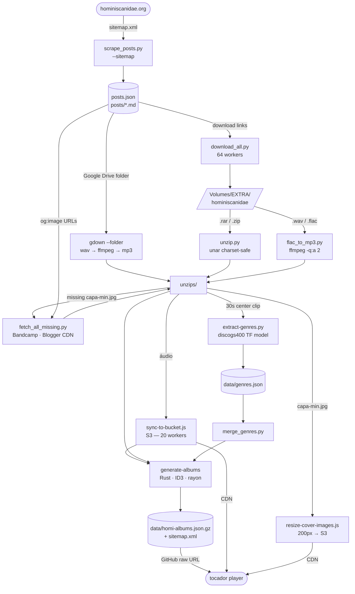

# Hominiscanidae

Arquivo digital do blog **Hominiscanidae** — um dos principais repositórios de música independente brasileira, ativo por mais de uma década com **10.609 posts**. Rock, metal, folk, eletrônico, experimental, indie, samba, MPB e muito mais — totalmente grátis e organizado para explorar.

> **Este repositório é uma instância do [tocador](https://github.com/rafapolo/tocador)**. O código do player, proxy e scripts vivem lá; aqui ficam apenas os dados e a configuração de deploy desta coleção.

## Catálogo

- **7.628 álbuns**, **~5.000 artistas**
- ~66 anos de música independente (1960–2026)
- 10.609 posts arquivados do blog; ~2.671 links mortos (permanentes)

## Como o acervo é montado

Os posts do blog são raspados, os arquivos baixados e descompactados, capas e gêneros
são inferidos automaticamente, e tudo é publicado num catálogo servido direto pelo
player do tocador.

## Licença e direitos

Mantido para fins educacionais e de preservação cultural. Os direitos pertencem aos respectivos artistas e detentores.

Se você é titular de direitos e deseja que algum conteúdo seja removido, abra uma [issue](https://github.com/rafapolo/hominiscanidae/issues).

---

[Visite o acervo →](https://rafapolo.github.io/hominiscanidae/)
