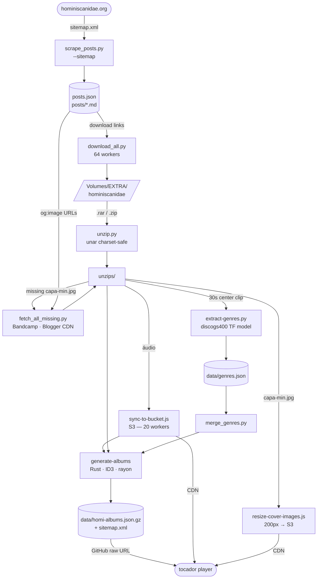

# Hominiscanidae

Arquivo digital do blog **Hominiscanidae** — um dos principais repositórios de música independente brasileira, ativo por mais de uma década com **10.609 posts**. Rock, metal, folk, eletrônico, experimental, indie, samba, MPB e muito mais — totalmente grátis e organizado para explorar.

> **Este repositório é uma instância do [tocador](https://github.com/rafapolo/tocador)**. O código do player, proxy e scripts vivem lá; aqui ficam apenas os dados e a configuração de deploy desta coleção.

## Catálogo

- **7.628 álbuns**, **~5.000 artistas**
- ~66 anos de música independente (1960–2026)
- 10.609 posts arquivados do blog; ~2.671 links mortos (permanentes)

## Pipeline



## Executar o pipeline completo

```bash
# 1. Scrape do blog (posts.json + posts/*.md)
python3 scripts/scrape/scrape_posts.py --sitemap

# 2. Download de todos os arquivos
python3 -u scripts/download/download_all.py >> download.log 2>&1 &

# 3. Descompactar com unar (charset PT-BR seguro)
python3 scripts/utils/unzip.py

# 4. Buscar capas faltantes (Bandcamp + Blogger CDN → capa-min.jpg)
python3 scripts/covers/fetch_all_missing.py

# 5. Sincronizar áudio para o bucket S3
ARCHIVE_DIR=/Volumes/EXTRA/hominiscanidae/unzips bun tocador/script/sync-to-bucket.js

# 6. Redimensionar e fazer upload das capas (200px → S3)
ARCHIVE_DIR=/Volumes/EXTRA/hominiscanidae/unzips bun tocador/script/resize-cover-images.js

# 7. Classificar gêneros com ML (discogs400, ~1.3s/faixa)
ARCHIVE_DIR=/Volumes/EXTRA/hominiscanidae/unzips \
OUTPUT_FILE=data/genres.json \
python3 tocador/script/extract-genres.py --model discogs400

# 8. Mesclar gêneros no índice de álbuns
python3 scripts/utils/merge_genres.py

# 9. Gerar catálogo a partir dos MP3s (ID3 tags + sitemap)
cd /Users/polux/Projetos/tocador/script/generate-albums
./target/release/generate-albums /Volumes/EXTRA/hominiscanidae/unzips \
  /Users/polux/Projetos/hominiscanidae/data/homi-albums.json.gz \
  --title "Hominiscanidae" \
  --subtitle "Música Independente Brasileira" \
  --base-url "https://cdn.tocador.cc/indie" \
  --sitemap-url "https://tocador.cc"
```

## Scripts locais

| Script | O que faz |
|---|---|
| `scripts/scrape/scrape_posts.py` | Scrape do blog: constrói/atualiza `posts.json` e `posts/*.md` |
| `scripts/download/download_all.py` | Download de todos os arquivos (64 workers, multi-serviço) |
| `scripts/utils/unzip.py` | Descompacta `.rar`/`.zip` em `unzips/` com `unar` (charset PT-BR seguro) |
| `scripts/covers/fetch_all_missing.py` | Busca capas faltantes: Bandcamp og:image → Blogger CDN → bcbits |
| `tocador/script/sync-to-bucket.js` | Sobe arquivos de áudio para o S3 (20 workers) |
| `tocador/script/resize-cover-images.js` | Redimensiona capas para 200px e sobe para o S3 |
| `tocador/script/extract-genres.py` | Classifica gêneros com modelos Essentia TensorFlow |
| `scripts/utils/merge_genres.py` | Mescla `genres.json` no índice `homi-albums.json.gz` |
| `tocador/script/generate-albums/` | Binário Rust: gera `data/homi-albums.json.gz` com metadados ID3 |

## Scrape

```bash
# Re-escanear sitemap (novos posts)
python3 scripts/scrape/scrape_posts.py --sitemap

# Re-scrape de uma label específica (usa posts/ local, sem rede)
python3 scripts/scrape/scrape_posts.py --label "https://www.hominiscanidae.org/search/label/NOME"

# Verificar posts vazios
find posts/ -empty
```

## Download

```bash
# Download normal (em background)
python3 -u scripts/download/download_all.py >> download.log 2>&1 &

# Reabilitar mega (após ~6h de reset de quota):
# remover a linha "return skip-mega" no dispatcher (~linha 520)
```

## Charset / arquivos faltando

Sempre usar `unar` — `unrar` e Archive Utility do macOS descartam silenciosamente arquivos
com nomes PT-BR (ã, ô, ç) codificados como Latin-1/CP850 dentro de RARs.

```bash
# Re-baixar e re-extrair álbuns com charset errado (via Tor)
python3 scripts/download/refix_charset.py --tor
tail -f refix_charset.log
```

## Licença e direitos

Mantido para fins educacionais e de preservação cultural. Os direitos pertencem aos respectivos artistas e detentores.

Se você é titular de direitos e deseja que algum conteúdo seja removido, abra uma [issue](https://github.com/rafapolo/hominiscanidae/issues).

---

[Visite o acervo →](https://rafapolo.github.io/hominiscanidae/)
